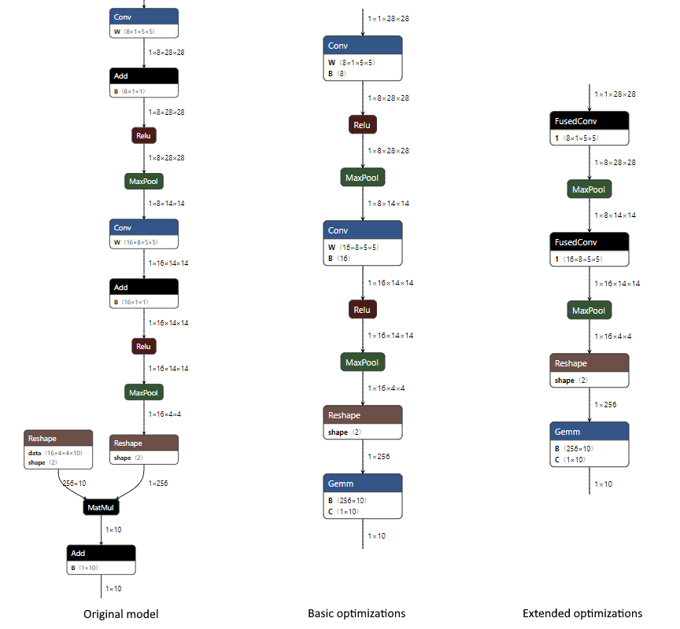
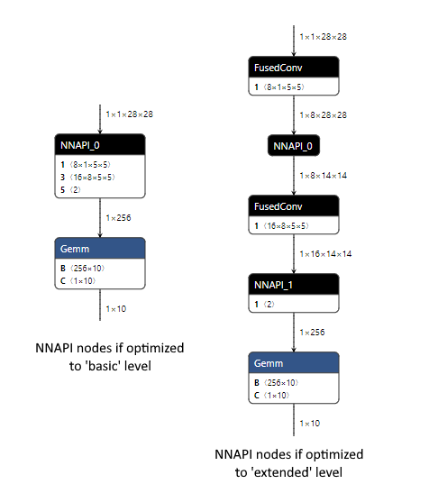
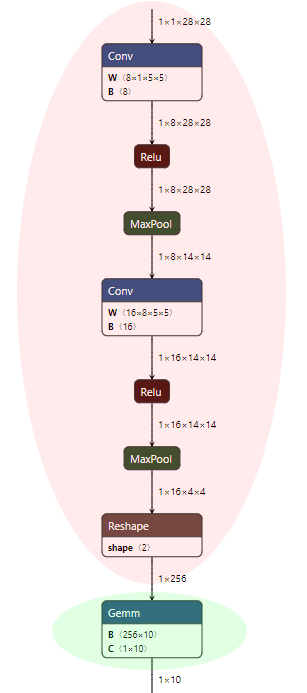

{::options toc_levels="2" /}

# ONNX Runtime Mobile Performance Tuning 

Learn how different optimizations affect performance, and get suggestions for performance testing with ORT format models.

ONNX Runtime Mobile can be used to execute ORT format models using NNAPI (via the NNAPI Execution Provider (EP)) on Android platforms, and CoreML (via the CoreML EP) on iOS platforms. 

First, please review the introductory details in [using NNAPI with ONNX Runtime Mobile](../execution-providers/NNAPI-ExecutionProvider.md) and [using CoreML with ONNX Runtime](../execution-providers/CoreML-ExecutionProvider.md).

**IMPORTANT NOTE:** The examples on this page refer to the NNAPI EP for brevity. The information equally applies to the CoreML EP, so any reference to 'NNAPI' below can be substituted with 'CoreML'.<br>
Support for creating a CoreML-aware ORT format model, similar to [creating an NNAPI-aware ORT format model](#3-creating-an-nnapi-aware-ort-format-model), was added in ONNX Runtime version 1.9.

## Contents
{: .no_toc}

* TOC
{:toc}


## 1. ONNX Model Optimization Example

ONNX Runtime applies optimizations to the ONNX model to improve inferencing performance. These optimizations occur prior to exporting an ORT format model. See the [graph optimization](./graph-optimizations.md) documentation for further details of the available optimizations.

It is important to understand how the different optimization levels affect the nodes in the model, as this will determine how much of the model can be executed using NNAPI or CoreML.

*Basic*

The _basic_ optimizations remove redundant nodes and perform constant folding. Only ONNX operators are used by these optimizations when modifying the model.

*Extended*

The _extended_ optimizations replace one or more standard ONNX operators with custom internal ONNX Runtime operators to boost performance. Each optimization has a list of EPs that it is valid for. It will only replace nodes that are assigned to that EP, and the replacement node will be executed using the same EP.

*Layout*

_Layout_ optimizations may be hardware specific and involve internal conversions between the NCHW image layout used by ONNX and NHWC or NCHWc formats. They are enabled with an optimization level of 'all'.

- For ONNX Runtime versions prior to 1.8 layout optimizations should not be used when creating ORT format models.
- For ONNX Runtime version 1.8 or later layout optimizations may be enabled, as the hardware specific optimizations are automatically disabled.


### Outcome of optimizations when creating an optimized ORT format model

Below is an example of the changes that occur in _basic_ and _extended_ optimizations when applied to the MNIST model with only the CPU EP enabled. The optimization level is specified when [creating the ORT format model](../reference/ort-model-format.md#optimization-level).

  - At the _basic_ level we combine the Conv and Add nodes (the addition is done via the 'B' input to Conv), we combine the MatMul and Add into a single Gemm node (the addition is done via the 'C' input to Gemm), and constant fold to remove one of the Reshape nodes.
    - `python <ORT repository root>/tools/python/convert_onnx_models_to_ort.py --optimization_level basic /dir_with_mnist_onnx_model`
  - At the _extended_ level we additionally fuse the Conv and Relu nodes using the internal ONNX Runtime FusedConv operator.
    - `python <ORT repository root>/tools/python/convert_onnx_models_to_ort.py --optimization_level extended /dir_with_mnist_onnx_model`



### Outcome of executing an optimized ORT format model with the NNAPI EP

If the NNAPI EP is registered at runtime, it is given an opportunity to select the nodes in the loaded model that it can execute. When doing so it will group as many nodes together as possible to minimize the overhead of copying data between the CPU and NNAPI to execute the nodes. Each group of nodes can be considered as a sub-graph. The more nodes in each sub-graph, and the fewer sub-graphs, the better the performance will be.

For each sub-graph, the NNAPI EP will create an [NNAPI model](https://developer.android.com/ndk/guides/neuralnetworks#model) that replicates the processing of the original nodes. It will create a function that executes this NNAPI model and performs any required data copies between CPU and NNAPI. ONNX Runtime will replace the original nodes in the loaded model with a single node that calls this function.

If the NNAPI EP is not registered, or can not process a node, the node will be executed using the CPU EP.

Below is an example for the MNIST model comparing what happens to the ORT format models at runtime if the NNAPI EP is registered.

As the _basic_ level optimizations result in a model that only uses ONNX operators, the NNAPI EP is able to handle the majority of the model as NNAPI can execute the Conv, Relu and MaxPool nodes. This is done with a single NNAPI model as all the nodes NNAPI can handle are connected. We would expect performance gains from using NNAPI with this model, as the overhead of the device copies between CPU and NNAPI for a single NNAPI node is likely to be exceeded by the time saved executing multiple operations at once using NNAPI.

The _extended_ level optimizations introduce the custom FusedConv nodes, which the NNAPI EP ignores as it will only take nodes that are using ONNX operators that NNAPI can handle. This results in two nodes using NNAPI, each handling a single MaxPool operation. The performance of this model is likely to be adversely affected, as the overhead of the device copies between CPU and NNAPI (which are required before and after each of the two NNAPI nodes) is unlikely to be exceeded by the time saved executing a single MaxPool operation each time using NNAPI. Better performance may be obtainable by not registering the NNAPI EP so that all nodes in the model are executed using the CPU EP.



## 2. Initial Performance Testing

The best optimization settings will differ by model. Some models may perform better with NNAPI, some models may not. As the performance will be model specific you must run performance tests to determine the best combination for your model.

It is suggested to run performance tests:
  - with NNAPI enabled and an ORT format model created with _basic_ level optimization
  - with NNAPI disabled and an ORT format model created with _extended_ or _all_ level optimization
    - use _all_ for ONNX Runtime version 1.8 or later, and _extended_ for previous versions

For most scenarios it is expected that one of these two approaches will yield the best performance.

If using an ORT format model with _basic_ level optimizations and NNAPI yields equivalent or better performance, it _may_ be possible to further improve performance by creating an NNAPI-aware ORT format model. The difference with this model is that the higher level optimizations are only applied to nodes that can not be executed using NNAPI. Whether any nodes fall into this category is model dependent.

## 3. Creating an NNAPI-aware ORT format model

An NNAPI-aware ORT format model will keep all nodes from the ONNX model that can be executed using NNAPI, and allow _extended_ optimizations to be applied to any remaining nodes.

For our MNIST model that would mean that after the _basic_ optimizations are applied, the nodes in the red shading are kept as-is, and nodes in the green shading could have _extended_ optimizations applied to them.



To create an NNAPI-aware ORT format model please follow these steps.

1. Create a 'full' build of ONNX Runtime with the NNAPI EP by [building ONNX Runtime from source](../build/inferencing.md#cpu).

    This build can be done on any platform, as the NNAPI EP can be used to create the ORT format model without the Android NNAPI library as there is no model execution in this process. When building add `--use_nnapi --build_shared_lib --build_wheel` to the build flags if any of those are missing.

    Do NOT add the `--minimal_build` flag.
    - Windows :
        ```
        <ONNX Runtime repository root>\build.bat --config RelWithDebInfo --use_nnapi --build_shared_lib --build_wheel --parallel
        ```

    - Linux:
        ```
        <ONNX Runtime repository root>/build.sh --config RelWithDebInfo --use_nnapi --build_shared_lib --build_wheel --parallel
        ```

    **NOTE** if you have previously done a minimal build you will need to run `git reset --hard` to make sure any operator kernel exclusions are reversed prior to performing the 'full' build. If you do not, you may not be able to load the ONNX format model due to missing kernels.

2. Install the python wheel from the build output directory.
    - Windows : This is located in `build/Windows/<config>/<config>/dist/<package name>.whl`.
    - Linux : This is located in `build/Linux/<config>/dist/<package name>.whl`.
        The package name will differ based on your platform, python version, and build parameters. `<config>` is the value from the `--config` parameter from the build command.
        ```
            pip install -U build\Windows\RelWithDebIfo\RelWithDebIfo\dist\onnxruntime_noopenmp-1.7.0-cp37-cp37m-win_amd64.whl
        ```

3. Create an NNAPI-aware ORT format model by running `convert_onnx_models_to_ort.py` as per the [standard instructions](../reference/ort-model-format.md), with NNAPI enabled (`--use_nnapi`), and the optimization level set to _extended_ or _all_ (e.g. `--optimization_level extended`). This will allow higher level optimizations to run on any nodes that NNAPI can not handle.
      ```
      python <ORT repository root>/tools/python/convert_onnx_models_to_ort.py --use_nnapi --optimization_level extended /models
      ```

    The python package from your 'full' build with NNAPI enabled must be installed for `--use_nnapi` to be a valid option

    This ORT model created can be used with a minimal build that includes the NNAPI EP.