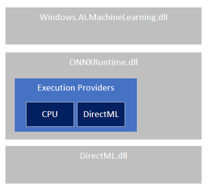

# ONNX Runtime High Level Design
{: .no_toc }

This document outlines the high level design of ONNX Runtime.

## Contents
{: .no_toc }

* TOC placeholder
{:toc}

## Key objectives

* Maximally and automatically leverage the custom accelerators and runtimes
available on disparate platforms.
* Provide the right abstraction and runtime support for custom accelerators and
runtimes. We call this abstraction an [execution
provider](https://github.com/microsoft/onnxruntime/tree/master/include//onnxruntime/core/framework/execution_provider.h). It defines and exposes a set of
its capabilities to ONNX Runtime: a set of single or fused nodes it can
execute, its memory allocator, and more. Custom accelerators and runtimes are
instances of execution providers.
* We don't expect that an execution provider can always run an ONNX model fully
on its device. This means that ONNX Runtime must be able to execute a single
model in a heterogeneous environment involving multiple execution providers.
* Provide support for high-level optimizations that can be expressed as
model-to-model transformations via a [graph-transformation
API](https://github.com/microsoft/onnxruntime/tree/master/include//onnxruntime/core/optimizer/graph_transformer.h). Such
transformations fall into two categories: global transformations, those that
require analysis and transformation of the entire graph, and local
transformations, which can be captured as simple (algebraic) [rewriting
rules](https://github.com/microsoft/onnxruntime/tree/master/include//onnxruntime/core/optimizer/rewrite_rule.h).

## High-level system architecture

The flow is quite simple.
1. Starting from an ONNX model, ONNX Runtime first
converts the model graph into its in-memory graph representation.
2. It performs a set of provider independent [optimizations](../performance/graph-optimizations).
3. It partitions the graph into a set of subgraphs based on the available execution providers.
4. Each subgraph is assigned to an execution provider. We ensure that a subgraph can be executed by an execution provider by querying the capability of the execution provider using the `GetCapability()` API.

### More about partitioning
{: .no_toc }
ONNX Runtime partitions a model graph into subgraphs based on the available execution providers, one for each distinct provider. ONNX Runtime provides a default execution provider that is used as the fallback execution for the
operators that cannot be pushed onto the more specialized but more efficient execution providers. Intuitively we want to push computation to more specialized execution providers whenever possible.

We use a simple graph partitioning technique. The available execution providers will be considered in a specific order, and each will be assigned the maximal subgraphs (possibly more than one) that it is able to handle. The ONNX Runtime-provided default execution provider will be the last one considered, and it ensures completeness. More sophisticated optimizations can be considered in the future (or can even be implemented as a composite execution provider).

Conceptually, each partition is reduced to a single fused operator. It is created by invoking the execution provider's Compile() method and wraps it as a custom operator. Currently we support only synchronous mode of execution. An execution provider exposes its memory allocator, which is used to allocate the input tensors for the execution provider. The rewriting and partitioning transform the initial model graph into a new graph composed of operators assigned to either the default execution provider or other registered execution providers. The ONNX Runtime execution engine is responsible for running this graph.

## Key design decisions

* Multiple threads can invoke the `Run()` method on the same
inference session object. See [API doc](../get-started/with-c.md) for more details.
* To facilitate this, the `Compute()` function of all kernels is const
implying the kernels are stateless.
* Implementations of the operators by execution providers are called
kernels. Each execution provider supports a subset of the (ONNX)
operators/kernels.
* ONNX Runtime guarantees that all operators are supported by the default
execution provider.
* Tensor representation: ONNX Runtime uses a standard representation for
the tensor runtime values. The execution providers can internally use a
different representation if they choose to, but it is their responsibility to convert the values from/to the standard representation at the boundaries of their subgraph.

## Extensibility Options

* [Add a custom operator/kernel](operators/add-custom-op.md)
* [Add an execution provider](../execution-providers/add-execution-provider.md)
* [Add a new graph transform](https://github.com/microsoft/onnxruntime/tree/master/include//onnxruntime/core/optimizer/graph_transformer.h)
* [Add a new rewrite rule](https://github.com/microsoft/onnxruntime/tree/master/include//onnxruntime/core/optimizer/rewrite_rule.h)

## Windows OS integration

ONNX Runtime is available in Windows 10 versions >= 1809 and all versions of Windows 11. It is embedded inside Windows.AI.MachineLearning.dll and exposed via the WinRT API (WinML for short). It includes the CPU execution provider and the [DirectML execution provider](../execution-providers/DirectML-ExecutionProvider) for GPU support.

The high level design looks like this:

### API choice
{: .no_toc }

You can choose to use either the WinRT API or the C API.

||WinRT|C API|
|--|--|--|
|Type system| Integration with Windows RT types| Platform neutral types|
|Language support| Language support via WinRT Projections| Language support via per language projections|
|Tensorization| Accepts VideoFrames and converts to tensors (support for CPU and GPU)| Accepts tensors|

### Distribution choice
{: .no_toc }

You can choose to use the runtime included in Windows, or use the [NuGet package](https://docs.microsoft.com/en-us/nuget/what-is-nuget) to ship the runtime with the app.

|Distribution|Inbox|App NuGet|
|--|--|--|
|Disk footprint| Included in the OS| Included in the App|
|Servicing fixes| Serviced by OS updates| Serviced by the App|
|Execution Providers| CPU & DirectML EP | App chosen EP|
|Compatibility testing| Tested with OS flights against supported GPUs and CPU's | App performs compatibility testing|
|Opset| Refreshed in OS updates| App chooses|

### Using the NuGet WinRT API with other C-API distributions
{: .no_toc }

The WinRT API NuGet package is distributed with a specific version of ONNX Runtime, but apps can include their own version of ONNX Runtime (either a [released version](../install/#cccwinml-installs) or [a custom build](../build/)). You may wish to do this to use non-default execution providers.
To use your own version of ONNX Runtime, replace onnxruntime.dll with your desired version.
