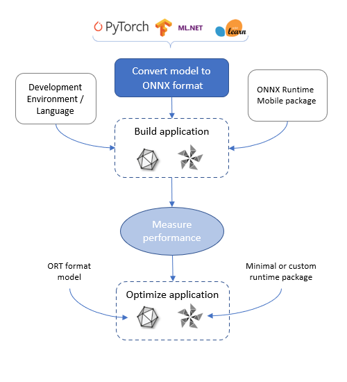

# How to develop a mobile application with ONNX Runtime

ONNX Runtime gives you a variety of options to add machine learning to your mobile application. This page outlines the flow through the development process. You can also check out the tutorials in this section:

* [Build an objection detection application on iOS](./deploy-ios.md)
* [Build an image classification application on Android](./deploy-android.md)

## ONNX Runtime mobile application development flow

{:width="80%"}

### Obtain a model

The first step in developing your mobile machine learning application is to obtain a model.

You need to understand your mobile app's scenario and get an ONNX model that is appropriate for that scenario. For example, does the app classify images, do object detection in a video stream, summarize or predict text, or do numerical prediction.

To run on ONNX Runtime mobile, the model is required to be in ONNX format. ONNX models can be obtained from the [ONNX model zoo](https://github.com/onnx/models). If your model is not already in ONNX format, you can convert it to ONNX from PyTorch, TensorFlow and other formats using one of the converters.

Because the model is loaded and run on device, the model must fit on the device disk and be able to be loaded into the device's memory.

### Develop the application

Once you have a model, you can load and run it using the ONNX Runtime API.

Which language bindings and runtime package you use depends on your chosen development environment and the target(s) you are developing for.

* Android Java/C/C++: onnxruntime-android package
* iOS C/C++: onnxruntime-c package
* iOS Objective-C: onnxruntime-objc package
* Android and iOS C# in MAUI/Xamarin: [Microsoft.ML.OnnxRuntime](https://www.nuget.org/packages/Microsoft.ML.OnnxRuntime/) and [Microsoft.ML.OnnxRuntime.Managed](https://www.nuget.org/packages/Microsoft.ML.OnnxRuntime.Managed/)

See the [install guide](https://onnxruntime.ai/docs/install/#install-on-web-and-mobile) for package specific instructions.

The above packages all contain the full ONNX Runtime feature and operator set and support for the ONNX format. We recommend you start with these to develop your application. Further optimizations may be required. These are detailed below.

You have a choice of hardware accelerators to use in your app, depending on the target platform:

* All targets have support for CPU and this is the default
* Applications that run on Android also have support for NNAPI and XNNPACK
* Applications that run on iOS also have support for CoreML and XNNPACK

Accelerators are called Execution Providers in ONNX Runtime.

If the model is quantized, start with the CPU Execution Provider. If the model is not quantized start with XNNPACK. These are the simplest and most consistent as everything is running on CPU.

If CPU/XNNPACK do not meet the application's performance results, then try NNAPI/CoreML. Performance with these execution providers is device and model specific. If the model is broken into multiple partitions due to the model using operators that ONNX Runtime, NNAPI/CoreML. or the device doesn't support (e.g. older NNAPI versions), performance may degrade.

Specific execution providers are configured in the SessionOptions, when the ONNXRuntime session is created and the model is loaded. For more detail, see your language [API docs](../../api).

### Measure the application's performance

Measure the application's performance against the requirements of your target platform. This includes:

* application binary size
* model size
* application latency
* power consumption

If the application does not meet its requirements, there are optimizations that can be applied.

### Optimize your application

#### Reduce model size

One method of reducing model size is to quantize the model. This reduces an original model with 32-bit weights by approximately a factor of 4, as the weights are reduced to 8-bit.

Another way of reducing the model size is to find a new model with the same inputs, outputs and architecture that has already been optimized for mobile. For example: MobileNet and MobileBert.

#### Reduce application binary size

There are two options for reducing the ONNX Runtime binary size.

1. Use the published packages that are optimized for mobile

   * Android Java/C/C++: onnxruntime-mobile
   * iOS C/C++: onnxruntime-mobile-c
   * iOS Objective-C: onnxruntime-mobile-objc

   These mobile packages have a smaller binary size but limited feature support, like a reduced set of operator implementations and the model must be converted to [ORT format](../../reference/ort-format-models.md#convert-onnx-models-to-ort-format).

   See the [install guide](../../install/#install-on-web-and-mobile) for package specific instructions.

   If the mobile package does not have coverage for all of the operators in your model, then you can build a custom runtime binary based your specific model.

2. Build a custom runtime based on your model(s)

   One of the outputs of the ORT format conversion is a build configuration file, containing a list of operators from your model(s) and their types. You can use this configuration as input to the custom runtime binary build script.

   The process to build a [custom runtime](../../build/custom.md) uses the same build scripts as standard ONNX Runtime, with some extra parameters.

To give an idea of the binary size difference between mobile and full packages:

ONNX Runtime 1.13.1 Android package `jni/arm64-v8a/libonnxruntime.so` dynamic library file size:

|Package|Size|
|-|-|
|onnxruntime-mobile|18.8 MB|
|onnxruntime-android|5.6 MB|
|custom (MobileNet)|_Coming soon_|

The iOS package is a static framework and so the library package size is not a good indication of the actual contribution to the application binary size. The above sizes for Android are good estimates for iOS.
